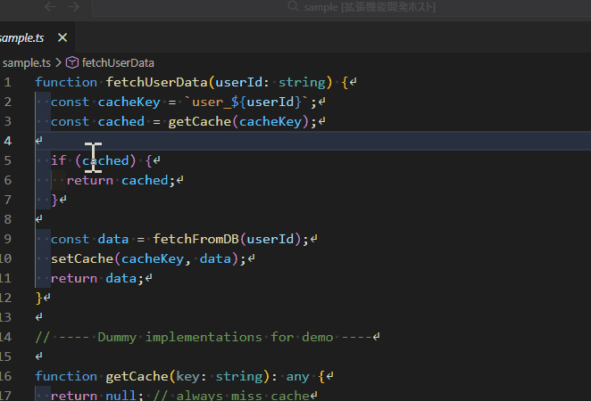

<p align="center">
  
</p>

[English](README.md) | 日本語

# QuickHighLight

選択した単語を色分けしてハイライトする VSCode 拡張機能  
（固定7色＋ユーザー色、QuickPick、ファイルをまたいだハイライト対応）

---

## ✨ 機能概要

QuickHighLight は、**選択した単語をワンクリックで色分けしてハイライト**できる VSCode 拡張機能です。



- 固定7色（カスタマイズ可能）
- ユーザー定義の色セット（いくつでも追加可能）
- QuickPick で色一覧を表示
- 右クリックメニューから即ハイライト
- ファイルをまたいでハイライトを維持
- 同じ色を別の単語に適用すると、前の単語のハイライトを自動解除
- トグル動作（同じ単語を同じ色で再度選ぶと解除）

コードレビュー、ログ解析、文章校正などに最適です。

---

## 🖱 使い方

### 1. 単語を選択する  
- 選択してもいいし  
- カーソルを単語の上に置くだけでも OK

### 2. 右クリック → Highlight メニュー  
- 固定7色  
- 色セット一覧（QuickPick）  
- ハイライト解除  

が表示されます。

### 3. 色を選ぶとハイライトされます  
- 同じ色を別の単語に適用すると、前の単語のハイライトは自動で解除  
- 同じ単語を同じ色で再度選ぶと解除（トグル）

---

## 🎨 QuickPick の UI

`Ctrl+Shift+P → Highlight: 色セット一覧（QuickPick）`

- 固定7色  
- 区切り線  
- ユーザー定義色  
- ●（現在ハイライト中の色）  
- キーワード表示（どの単語をハイライトしているか）

が一覧で確認できます。

---

## 🧩 固定7色のカスタマイズ

`settings.json` に以下を追加すると、固定7色を上書きできます。

```jsonc
"highlightWord.fixedColorSets": [
  { "name": "Caution",  "background": "#ff5555", "foreground": "#ffffff" },
  { "name": "Deep",     "background": "#4455aa", "foreground": "#ffffff" },
  { "name": "Emphasis", "background": "#ff8800", "foreground": "#ffffff" },
  { "name": "Info",     "background": "#5599ff", "foreground": "#ffffff" },
  { "name": "Marker",   "background": "#ffee55", "foreground": "#000000" },
  { "name": "OK",       "background": "#55cc55", "foreground": "#000000" },
  { "name": "Review",   "background": "#aa55cc", "foreground": "#ffffff" }
]
```

## 🎛 ユーザー定義の色セット

`settings.json` に追加するだけで、QuickPick に表示されます。

```jsonc
"highlightWord.colorSets": [
  { "name": "Soft Yellow", "background": "#ffeeaa", "foreground": "#000000" },
  { "name": "Deep Blue", "background": "#3366ff", "foreground": "#ffffff" }
]
```

## 🧠 ハイライトの仕様
単語単位で検索（大文字小文字は区別）

開いている全ファイルに適用

エディタ切り替え時に自動再適用

色は「1色 = 1単語」
→ 同じ色を別の単語に適用すると、前の単語のハイライトは自動解除

トグル動作
→ 同じ単語を同じ色で再度選ぶと解除

## 📦 コマンド一覧

| コマンド | 説明 |
|---------|------|
| Caution | 固定色1 |
| Deep | 固定色2 |
| Emphasis | 固定色3 |
| Info | 固定色4 |
| Marker | 固定色5 |
| OK | 固定色6 |
| Review | 固定色7 |
| Clear All Highlights | 全てのハイライトを解除 |
| Choose Color Set | QuickPick を開く |


## 📄 ライセンス
MIT License

## 🔚 最後に
QuickHighLight は、
「シンプルで壊れにくく、気持ちよく使えるハイライト拡張」
を目指して作られています。

改善案や要望があれば、ぜひ教えてください。
